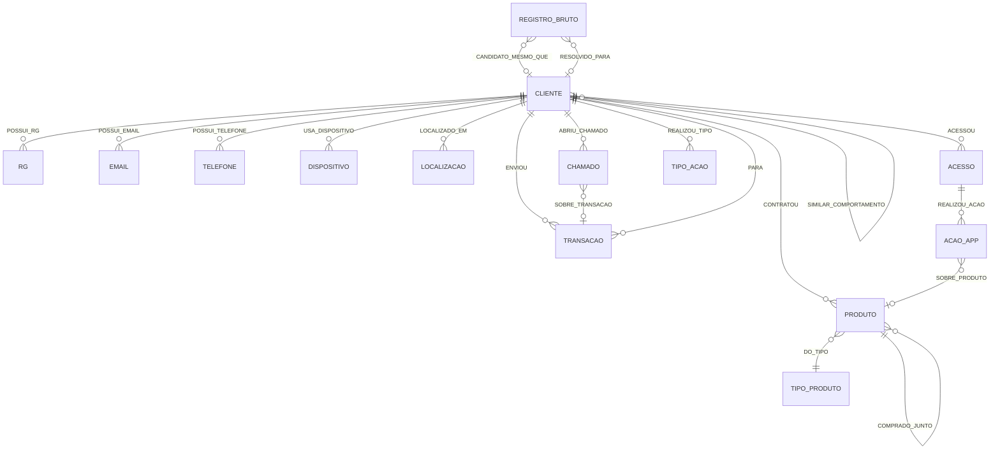

# Modelo de Dados — "FinTechConecta"

> Fase 1 do workshop: o modelo de grafo. As demais fases (CSVs fake, constraints + carga via
> `LOAD CSV`, GDS e agentes) estão descritas em [01-plano-workshop.md](01-plano-workshop.md) e
> serão geradas a partir deste modelo.

## Por que este domínio

O modelo abaixo é, na prática, uma visão **Customer 360** do cliente: identidades, transações e
produtos contratados, tudo conectado a um único nó `Cliente`. O objetivo do workshop é mostrar
**essa mesma base em grafo** sendo usada para dois casos de uso de negócio completamente diferentes
— detecção de fraude e recomendação — sem remodelar nada entre uma demo e outra. Só muda o algoritmo
de GDS que "olha" para o grafo.

Um domínio de fintech/banking digital resolve isso bem porque naturalmente tem:
- **Identidades reutilizáveis** (e-mail, telefone, RG, dispositivo) → sinal de fraude.
- **Transações entre clientes (Pix)** → sinal de fluxo de dinheiro / contas-laranja.
- **Contratação de produtos financeiros** (cartão, empréstimo, seguro, investimento) → sinal de
  recomendação / cross-sell, exatamente como pedidos de itens em um cardápio.
- **Chamados multicanal + acessos/ações no app** → sinal de jornada: dá pra encadear, em ordem
  cronológica, tudo que um cliente fez (logou, transacionou, abriu um chamado), o mesmo padrão de
  `NEXT` que aparece no schema real inspecionado via `aura-mcp`.

### Fontes usadas como inspiração

| Fonte | O que aproveitamos |
|---|---|
| [Account Takeover Fraud (Neo4j Developer)](https://neo4j.com/developer/industry-use-cases/finserv/retail-banking/account-takeover-fraud/) | Nós de identidade soltos (Device, Email, Phone, Location) como sinal de fraude; cadeia de eventos; detecção por atributos compartilhados |
| [Recommendation Engine Hands-On #1 (NeoRestro)](https://neo4j.com/blog/developer/recommendation-engine-hands-on-1/) | Padrão `(:User)-[:HAS_ORDERED]->(:Item)` e `(:Item)-[:ORDERED_ALONG_WITH]->(:Item)` para collaborative + content-based filtering |
| Schema real inspecionado via `aura-mcp` (`get-schema`) | Confirma que em produção isso já converge: `Consumer`, `Product`, `Transaction`, `Device`, `Email`, `Location`, `SupportTicket`, `MetricSnapshot`, mais propriedades já derivadas de GDS (`collusion_component_id`, `clusterId`, relacionamento `SIMILAR_TO` com `similarity_score`, `USES_PRODUCT{count,total_value,last_used}`) e um relacionamento `NEXT` encadeando `Transaction`/`MetricSnapshot`/`SupportTicket` em ordem cronológica por cliente — a inspiração direta da jornada abaixo. **Usado só como referência estrutural** — nenhum dado real é reaproveitado; a base do workshop é 100% fictícia. |
| [neo4j-agente-fraude](https://github.com/elizarp/neo4j-agente-fraude) (seu repo) | Cliente identificado por CPF, identificadores soltos (RG/Email/Telefone) gerando anéis de fraude, WCC + PageRank, Aura Agent com CypherTemplate tools |

## Diagrama (Mermaid)



A **jornada** do cliente é o encadeamento cronológico de `Acesso`, `Transacao` e `Chamado` (os três
têm timestamp), construído na fase 3 com `PROXIMO_EVENTO` — ver seção
[Jornada do cliente](#jornada-do-cliente) abaixo.

## Nós

| Label | Propriedades principais | Papel no workshop |
|---|---|---|
| `Cliente` | `cliente_id` (PK), `nome`, `cpf`, `dataNascimento`, `cidade`, `estado`, `segmento`, `dataCadastro` | Entidade central. Ponto de partida de fraude e de recomendação. |
| `RG` | `rg_id` (PK), `numero` | Identidade solta — reuso entre clientes = indício de anel de fraude. |
| `Email` | `email_id` (PK), `endereco`, `dominio` | Idem. |
| `Telefone` | `telefone_id` (PK), `numero`, `ddd` | Idem. |
| `Dispositivo` | `device_id` (PK), `modelo`, `sistemaOperacional` | Reuso do mesmo aparelho em várias contas = credential stuffing / account takeover. |
| `Localizacao` | `location_id` (PK), `cidade`, `estado`, `latitude`, `longitude` | Suporta detecção de "viagem impossível" (opcional, storytelling). |
| `Transacao` | `transacao_id` (PK), `valor`, `data`, `tipo` (`Pix`\|`Boleto`\|`Cartao`) | Multi-label: `:Transacao:Pix`. Fluxo de dinheiro entre clientes. |
| `Produto` | `produto_id` (PK), `nome`, `categoria` | Cartão de crédito, empréstimo, seguro, investimento, consórcio. |
| `TipoProduto` | `tipo_id` (PK), `nome`, `ehContrato` | Agrupa produtos por categoria (recomendação por conteúdo). |
| `Chamado` | `chamado_id` (PK), `canal` (`Telefone`\|`Chat`\|`App`\|`E-mail`\|`Agência`), `assunto`, `severidade`, `status`, `abertoEm`, `resolvidoEm`, `tempoResolucaoHoras`, `satisfacao` | Ocorrência multicanal. Alimenta a jornada e, quando `assunto = "Contestação de transação"`, aponta pra `Transacao` disputada. |
| `Acesso` | `acesso_id` (PK), `dataHora`, `canal` (`App`\|`WebApp`), `sucesso`, `duracaoSegundos` | Login/sessão no app. `sucesso=false` simula tentativa falha (sinal de account takeover). |
| `AcaoApp` | `acao_id` (PK), `tipo` (`ConsultarSaldo`\|`ConsultarExtrato`\|`VisualizarProduto`\|`SimularEmprestimo`\|`IniciarContratacao`\|`PagarPix`\|`AlterarDadosCadastrais`\|`AbrirChamado`), `dataHora` | Ação dentro de uma sessão. Clickstream que dá granularidade fina à jornada. |
| `TipoAcao` | `nome` (PK) | Os 8 tipos distintos de `AcaoApp`. **Não vem de CSV** — criado na fase 4 por agregação Cypher, igual ao padrão de `TipoProduto`. Base da segmentação comportamental. |
| `RegistroBruto` | `registro_id` (PK), `nomeBruto`, `cpfBruto`, `telefoneBruto`, `dataNascimentoBruto`, `cidadeBruto`, `canalOrigem` | Registro de cliente capturado por outro sistema (agência legada, sistema adquirido, migração), com ruído de digitação — nome abreviado, CPF mascarado, telefone sem DDD. Não tem link com `Cliente` na carga — é isso que a resolução de identidade (fase 4) descobre. |


## Relacionamentos

| Tipo | De → Para | Propriedades | Uso |
|---|---|---|---|
| `POSSUI_RG` / `POSSUI_EMAIL` / `POSSUI_TELEFONE` | Cliente → RG/Email/Telefone | `desde` | Base do grafo de identidades compartilhadas (fraude). |
| `USA_DISPOSITIVO` | Cliente → Dispositivo | `primeiroAcesso`, `ultimoAcesso` | Idem, sinal de account takeover. |
| `LOCALIZADO_EM` | Cliente → Localizacao | — | Contexto geográfico. |
| `ENVIOU` | Cliente → Transacao | — | Quem originou a transação (fluxo de saída). |
| `PARA` | Transacao → Cliente | — | Destino da transação (fluxo de entrada). Polimórfico como no artigo de fraude. |
| `CONTRATOU` | Cliente → Produto | `vezes`, `valorTotal`, `ultimoUso` | Equivalente a `HAS_ORDERED`/`USES_PRODUCT` — base da recomendação colaborativa. |
| `DO_TIPO` | Produto → TipoProduto | — | Base da recomendação por conteúdo. |
| `COMPRADO_JUNTO` | Produto ↔ Produto | `vezes` | Equivalente a `ORDERED_ALONG_WITH` — market basket / co-contratação. |
| `SIMILAR_A` | Cliente ↔ Cliente | `score` | **Escrito pelo GDS** (`gds.nodeSimilarity.filtered.write`, Jaccard), não carregado via CSV. |
| `SIMILAR_A_EMBEDDING` | Cliente ↔ Cliente | `score` | **Escrito pelo GDS** (`gds.fastRP.mutate` + `gds.knn.filtered.write`) — segunda técnica de similaridade, pra comparar com `SIMILAR_A` na demo. |
| `ABRIU_CHAMADO` | Cliente → Chamado | — | Ocorrência multicanal do cliente. |
| `SOBRE_TRANSACAO` | Chamado → Transacao | — | Só existe quando `assunto = "Contestação de transação"` — liga o chamado à transação disputada. |
| `ACESSOU` | Cliente → Acesso | — | Login/sessão no app. |
| `REALIZOU_ACAO` | Acesso → AcaoApp | — | Ações dentro da sessão (clickstream). |
| `SOBRE_PRODUTO` | AcaoApp → Produto | — | Só existe pra ações do tipo `VisualizarProduto`/`SimularEmprestimo`/`IniciarContratacao`. |
| `PROXIMO_EVENTO` | (Acesso\|Transacao\|Chamado) → (Acesso\|Transacao\|Chamado) | `diasAte` | **Escrito na fase 3** (não vem de CSV) — encadeia os eventos com timestamp de cada cliente em ordem cronológica. Ver [Jornada do cliente](#jornada-do-cliente). |
| `REALIZOU_TIPO` | Cliente → TipoAcao | `vezes` | **Calculado na fase 4** por agregação sobre `AcaoApp.tipo` — base bipartida da segmentação comportamental. |
| `SIMILAR_COMPORTAMENTO` | Cliente ↔ Cliente | `score` | **Escrito pelo GDS** (Node Similarity sobre `REALIZOU_TIPO`) — clientes parecidos por *como usam os canais*, não por *o que compram* (isso é o `SIMILAR_A`). |
| `CANDIDATO_MESMO_QUE` | RegistroBruto → Cliente | `score`, `sinais` | **Escrito pelo GDS/Cypher** (fase 4, resolução de identidade) — todo candidato acima de um piso de confiança, mesmo que baixo. |
| `RESOLVIDO_PARA` | RegistroBruto → Cliente | `score` | Idem, só para o candidato de maior confiança acima de um piso alto — a decisão final de resolução ("golden record"). |

## Como o mesmo grafo alimenta múltiplos casos de uso

| Caso de uso | Subgrafo usado | Algoritmos GDS (fase 4) |
|---|---|---|
| **Detecção de fraude** | `RG`/`Email`/`Telefone`/`Dispositivo` compartilhados + `Transacao{PARA}` + `Acesso{sucesso=false}` | **WCC** (Weakly Connected Components) sobre identificadores compartilhados → `grupoFraude`; **PageRank/Degree** sobre o grafo de Pix → hubs suspeitos ("contas-laranja") |
| **Recomendação** | `Cliente-[:CONTRATOU]->Produto` (bipartido) + `Produto-[:DO_TIPO]->TipoProduto` | **Node Similarity** (Jaccard/Overlap) → clientes parecidos (collaborative filtering); **FastRP + KNN** → embeddings de cliente/produto para similaridade em escala; consulta em `COMPRADO_JUNTO` → recomendação por conteúdo/cross-sell |
| **Jornada / Customer 360** | `Acesso`/`Transacao`/`Chamado` encadeados por `PROXIMO_EVENTO` | **Path Finding do GDS** (BFS/Dijkstra) sobre a cadeia `PROXIMO_EVENTO`, ex.: achar clientes cuja jornada recente é `Acesso{sucesso=false}` → `Acesso{sucesso=true, novo dispositivo}` → `Transacao{alto valor}` → `Chamado{Contestação}`, o padrão clássico de account takeover contado como sequência, não só como comunidade — importante: isso também é GDS, não só Cypher, pra bater com o texto da proposta submetida ao TDC |
| **Churn** | `Acesso`/`Transacao` (recência) + `Chamado` (insatisfação) | Sem GDS pesado — recência calculada em Cypher (`duration.inDays`), ranqueada por cliente. Reaproveita os mesmos dados da jornada, é só outra pergunta pro grafo. |
| **Segmentação comportamental** | `Cliente-[:REALIZOU_TIPO]->TipoAcao` (bipartido, calculado da `AcaoApp`) | **Node Similarity** → `SIMILAR_COMPORTAMENTO` (quem usa os canais do mesmo jeito); **Louvain** → `Cliente.segmentoComportamental` (persona/comunidade). Contraste didático com fraude: WCC acha anel por identidade *idêntica*, Louvain acha segmento por comportamento *parecido* — mesma família de algoritmo (detecção de comunidade), pergunta de negócio diferente. |
| **Resolução de identidade** | `RegistroBruto` (sem link inicial) vs. `Cliente` | Blocking + similaridade fuzzy (`apoc.text.jaroWinklerDistance` no nome, correspondência parcial de CPF/telefone/data de nascimento) → `CANDIDATO_MESMO_QUE`/`RESOLVIDO_PARA`. Resolve o problema inverso da fraude: lá, o mesmo identificador em clientes *diferentes* é suspeito; aqui, atributos *parecidos mas não idênticos* em registros de sistemas diferentes têm que voltar a apontar pro mesmo cliente real. |

Todos escrevem de volta no grafo (`grupoFraude`, `scoreInfluencia`, `SIMILAR_A`, `PROXIMO_EVENTO`),
o que permite que o **mesmo agente conversacional** (fase 5) responda "esse cliente faz parte de um
anel de fraude?", "que produto eu recomendo pra esse cliente?" e "me mostra a jornada recente desse
cliente" usando CypherTemplates parametrizados — no mesmo padrão do seu
[aura-agent](https://github.com/elizarp/neo4j-agente-fraude/tree/main/aura-agent).

## Jornada do cliente

`Acesso`, `Transacao` e `Chamado` são tipos de nó diferentes, mas todos têm um timestamp
(`dataHora`, `data`, `abertoEm`). Na fase 3, depois da carga, uma única consulta une os três por
`UNION`, ordena por timestamp e encadeia consecutivos com `PROXIMO_EVENTO`:

```cypher
MATCH (c:Cliente)
CALL (c) {
  MATCH (c)-[:ENVIOU]->(e:Transacao)      RETURN e, e.data     AS quando
  UNION
  MATCH (c)-[:ACESSOU]->(e:Acesso)        RETURN e, e.dataHora AS quando
  UNION
  MATCH (c)-[:ABRIU_CHAMADO]->(e:Chamado) RETURN e, e.abertoEm AS quando
}
WITH c, e, quando ORDER BY quando
WITH c, collect(e) AS eventos
UNWIND range(0, size(eventos) - 2) AS i
WITH eventos[i] AS e1, eventos[i + 1] AS e2
MERGE (e1)-[:PROXIMO_EVENTO]->(e2)
```

Isso reproduz, com dados fictícios, o mesmo padrão de `NEXT` que aparece no schema real inspecionado
via `aura-mcp` — só que aqui dá pra contar a história completa de um ataque de account takeover como
uma travessia de caminho: login falho → login com sucesso de um dispositivo novo → Pix de alto valor
→ chamado de contestação, tudo em sequência.


## Chaves de unicidade previstas (constraints virão na fase 3)

`Cliente.cliente_id`, `RG.rg_id`, `Email.email_id`, `Telefone.telefone_id`,
`Dispositivo.device_id`, `Localizacao.location_id`, `Transacao.transacao_id`, `Produto.produto_id`,
`TipoProduto.tipo_id`, `Chamado.chamado_id`, `Acesso.acesso_id`, `AcaoApp.acao_id`,
`RegistroBruto.registro_id`, `TipoAcao.nome`.

## Orçamento de nós (dimensionamento pro free tier)

AuraDB Free tem um teto de **200 mil nós**. O gerador (fase 2) mira ficar perto disso sem passar —
hoje calibrado pra **~195.000 nós** com **1.500 clientes**:

| Grupo | Nós | Observação |
|---|---|---|
| `Cliente` + identidades (`RG`/`Email`/`Telefone`/`Dispositivo`) + `Localizacao` + `Produto`/`TipoProduto` | ≈ 7.300 | Fixo/quase-fixo — não escala com o volume de eventos |
| `Acesso` | ≈ 52.600 | ~35 acessos/cliente em média |
| `AcaoApp` | ≈ 107.000 | ~2 ações por acesso |
| `Transacao` | ≈ 24.400 | ~16 Pix/cliente em média |
| `Chamado` | ≈ 3.800 | maioria dos clientes com 0, poucos concentram vários |
| **Total** | **≈ 195.000** | margem de ~2,5% antes do teto de 200 mil |

O gerador calcula o overhead fixo primeiro (depois da geração de identidades, já deduplicadas pelos
anéis de fraude) e só então distribui o orçamento restante entre `Acesso`/`AcaoApp`/`Transacao`/
`Chamado` por proporção fixa — então o total nunca estoura, mesmo mudando `N_CLIENTES`.

## Próximas fases

1. **Fase 2 — CSVs fake** (`data/`): gerar clientes, identidades compartilhadas (anéis de fraude
   injetados), transações Pix, contratações de produto, chamados multicanal e acessos/ações no app
   (com viés de coocorrência e de atividade por cliente para os sinais de GDS e a jornada ficarem
   interessantes).
2. **Fase 3 — Constraints + carga** (`cypher/`): `CREATE CONSTRAINT` para cada chave acima, depois
   `LOAD CSV` idempotente com `MERGE`, e a consulta de `PROXIMO_EVENTO` da jornada.
3. **Fase 4 — GDS** (`gds/`): projeção, WCC + PageRank (fraude), Node Similarity + FastRP/KNN
   (recomendação), BFS (jornada), Louvain + Node Similarity (segmentação comportamental), blocking +
   similaridade fuzzy (resolução de identidade) — escrita de volta no grafo.
4. **Fase 5 — Agentes**: um único Aura Agent cobrindo fraude, recomendação, Customer 360, jornada e
   churn, no padrão de CypherTemplates do `aura-agent` existente.
